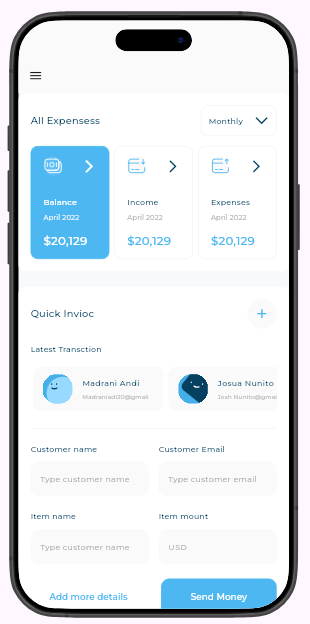
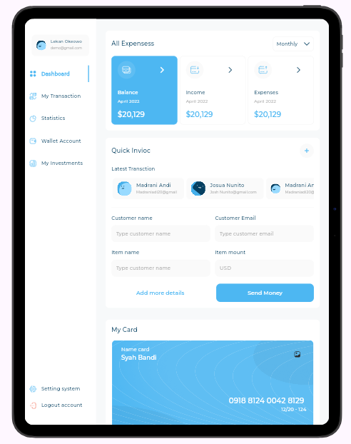
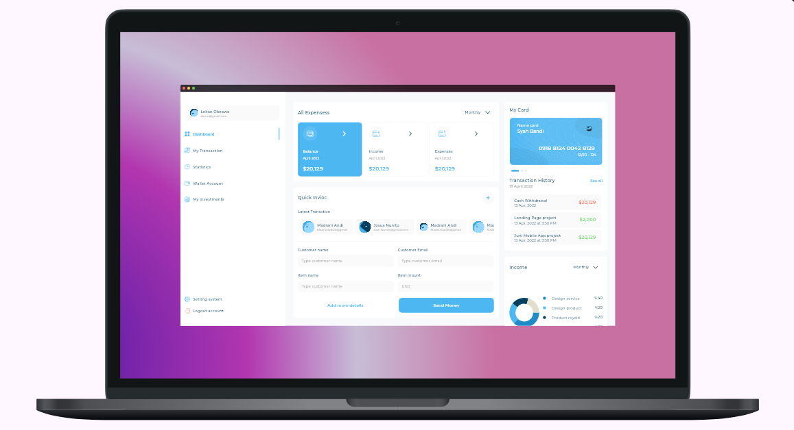

# 📊 Responsive Dashboard App

A modern and fully responsive dashboard application built using Flutter and Dart.  
This project demonstrates how to build scalable UI layouts that adapt seamlessly across mobile, tablet, and desktop screens.

---

## 🚀 Features

- 📱 Responsive Design (Mobile, Tablet, Desktop)
- 🎨 Clean & Modern UI
- 🧩 Modular Architecture
- 🖼️ Custom Assets
- ⚡ Fast Performance

---

## 📂 Project Structure

```
lib/
│── models/    # Data models
│── views/     # UI screens
│── widgets/   # Reusable components
│── utils/     # Helper functions
│
└── main.dart  # Entry point
```

---

## 🛠️ Technologies Used

- Flutter
- Dart
- MediaQuery
- LayoutBuilder

---

## ▶️ Getting Started

### 1. Clone the repository

git clone https://github.com/your-username/responsive_dash_board.git  
cd responsive_dash_board

### 2. Install dependencies

flutter pub get

### 3. Run the app

flutter run

---

## 📸 Screenshots

<p align="center">
  
  
  
</p>

---

## 💡 What You’ll Learn

- Responsive UI in Flutter
- Adaptive layouts
- Reusable widgets
- Clean architecture
